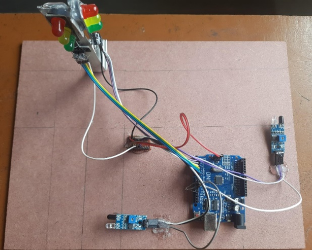

# Density-Based Traffic Control System

## Project Description
This project controls traffic signals based on vehicle density at road junctions. Signals change automatically depending on traffic load.

## Components Used
- Arduino Board
- IR Sensors
- LEDs for traffic lights
- Power supply
- Connecting wires

## Working Principle
Sensors detect vehicle density on roads. The road with higher traffic gets longer green signal time.

## Files Included
- traffic_control.ino – Arduino code
- circuit_diagram.png – Circuit diagram
- block_diagram.png – System diagram
- Project_Report.pdf – Full report
- Model and scenario images

## Applications
- Smart traffic control
- Reduces traffic congestion
## Working Model

